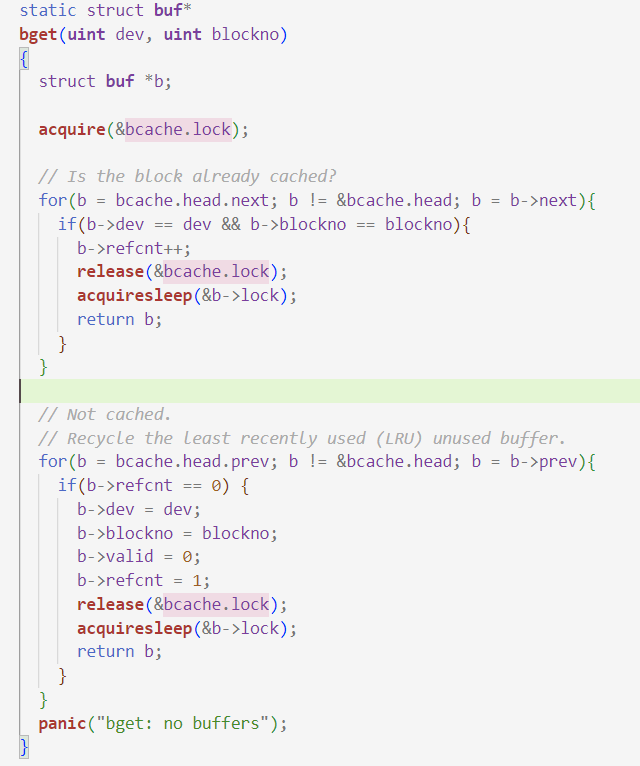

# Lab: locks

reference:

[Lab8: Locks · 6.S081 All-In-One (dgs.zone)](http://xv6.dgs.zone/labs/answers/lab8.html)

Some questions needed to be solved:

1. when a process start, what data structure will be initialized by OS? where are they stored?


**Target**:

re-design parallelism, which may be help for my future job?


Reading note:

这个实验涉及file system的内容，但是还没有开始学习，所以先把提及的内容学下来以促进实验过程的理解。

**PGROUNDUP function:**  to ensure that it frees only aligned physical addresses.

**Buffer cache layer**: 

- 规范访问disk block的次序，确保RAM和disk之间一个block只有一个copy，一次只有一个线程使用这份copy.

- 热数据提前载入cache以提高速度
- （此外）对buffer的读写需要lock

```c
struct buf {
  int valid;   // has data been read from disk?
  int disk;    // does disk "own" buf?
  uint dev;
  uint blockno;
  struct sleeplock lock;
  uint refcnt;
  struct buf *prev; // LRU cache list
  struct buf *next;
  uchar data[BSIZE];
};
// buffer data structure
```

对这个cache的get, read, write操作，值得另外去讨论，因为过程中涉及cache的情况锁， block的内容锁


change:

```diff
diff --git a/kernel/kalloc.c b/kernel/kalloc.c
index fa6a0ac..c5005ae 100644
--- a/kernel/kalloc.c
+++ b/kernel/kalloc.c
@@ -21,12 +21,16 @@ struct run {
 struct {
   struct spinlock lock;
   struct run *freelist;
-} kmem;
+} kmem[NCPU];
 
 void
 kinit()
 {
-  initlock(&kmem.lock, "kmem");
+  char lockname[8];
+  for(int i = 0;i < NCPU; i++) {
+    snprintf(lockname, sizeof(lockname), "kmem_%d", i);
+    initlock(&kmem[i].lock, lockname);
+  }
   freerange(end, (void*)PHYSTOP);
 }
 
@@ -34,6 +38,7 @@ void
 freerange(void *pa_start, void *pa_end)
 {
   char *p;
+
   p = (char*)PGROUNDUP((uint64)pa_start);
   for(; p + PGSIZE <= (char*)pa_end; p += PGSIZE)
     kfree(p);
@@ -56,27 +61,51 @@ kfree(void *pa)
 
   r = (struct run*)pa;
 
-  acquire(&kmem.lock);
-  r->next = kmem.freelist;
-  kmem.freelist = r;
-  release(&kmem.lock);
+  push_off();  // 关中断
+  int id = cpuid();
+  acquire(&kmem[id].lock);
+  r->next = kmem[id].freelist;
+  kmem[id].freelist = r;
+  release(&kmem[id].lock);
+  pop_off();  //开中断
 }
 
 // Allocate one 4096-byte page of physical memory.
 // Returns a pointer that the kernel can use.
 // Returns 0 if the memory cannot be allocated.
+// add a trick for "steal"
 void *
 kalloc(void)
 {
   struct run *r;
+  push_off();  // 关中断
+  int id = cpuid();
 
-  acquire(&kmem.lock);
-  r = kmem.freelist;
+  acquire(&kmem[id].lock);
+  r = kmem[id].freelist;
   if(r)
-    kmem.freelist = r->next;
-  release(&kmem.lock);
+    kmem[id].freelist = r->next;
+  else{  // steal 
+    int antid;  // another id
+    // 遍历所有CPU的空闲列表
+    for(antid = 0; antid < NCPU; ++antid) {
+      if(antid == id)
+        continue;
+      acquire(&kmem[antid].lock);
+      r = kmem[antid].freelist;
+      if(r) {
+        kmem[antid].freelist = r->next;
+        release(&kmem[antid].lock);
+        break;
+      }
+      release(&kmem[antid].lock);
+    }
+  }
+  release(&kmem[id].lock);
 
+  pop_off();  //开中断
   if(r)
     memset((char*)r, 5, PGSIZE); // fill with junk
+
   return (void*)r;
 }
```


```bash
//the number means funcions iteration, which is a index/quantity for call amount
style:
lock: [file?]: [lock name] [call amount] 
$ kalloctest
start test1
test1 results:
--- lock kmem/bcache stats
lock: bcache: #test-and-set 0 #acquire() 1198
--- top 5 contended locks:
lock: uart: #test-and-set 3588250 #acquire() 1337
lock: proc: #test-and-set 2463661 #acquire() 249102
lock: proc: #test-and-set 2099972 #acquire() 249102
lock: proc: #test-and-set 2056880 #acquire() 249102
lock: proc: #test-and-set 1946263 #acquire() 249102
tot= 0
test1 OK
start test2
total free number of pages: 32499 (out of 32768)
.....		
```

## Buffer cache 

last experiment is about allocating a **4kb page** of physical memory(**RAM**) for a thread/CPU among CPUs' free page lists. this experiment is about **RAM<->Block cache** 

processes contend for `bcache.lock`frequently, when call `bget` and `brelse` 



- how to preload the heat blocks?

use time-stamp to make a sort

- eviction?

> Cache eviction is a feature where file data blocks in the cache are released when fileset usage exceeds the fileset soft quota, and space is created for new files

- why use hash buckets(hash table)?

allocate blocks into cache buffer on average.

- difference between `sleeplock`and `spinlock` 

> Actually, we can distinguish among two main categories of locks: 1) spin locks, which are based on threads actively waiting for the ownership in the access to the targeted shared resource; 2) sleep locks, which make threads not run on any CPU-core until they can (retry to) acquire the access ownership
>
> that is to say: sleeplock release CPU resources

**change:**

```diff
diff --git a/kernel/bio.c b/kernel/bio.c
index 60d91a6..74fa4ea 100644
--- a/kernel/bio.c
+++ b/kernel/bio.c
@@ -23,32 +23,43 @@
 #include "fs.h"
 #include "buf.h"
 
+#define NBUCKET 13
+#define HASH(id) (id % NBUCKET)
+
+struct hashbuf {
+  struct buf head;       // 头节点
+  struct spinlock lock;  // 锁
+};
+
 struct {
-  struct spinlock lock;
   struct buf buf[NBUF];
-
-  // Linked list of all buffers, through prev/next.
-  // Sorted by how recently the buffer was used.
-  // head.next is most recent, head.prev is least.
-  struct buf head;
+  struct hashbuf buckets[NBUCKET];  // 散列桶
 } bcache;
 
 void
 binit(void)
 {
   struct buf *b;
+  char lockname[16];
 
-  initlock(&bcache.lock, "bcache");
+  for(int i = 0; i < NBUCKET; ++i) {
+    // 初始化散列桶的自旋锁
+    snprintf(lockname, sizeof(lockname), "bcache_%d", i);
+    initlock(&bcache.buckets[i].lock, lockname);
+
+    // 初始化散列桶的头节点
+    bcache.buckets[i].head.prev = &bcache.buckets[i].head;
+    bcache.buckets[i].head.next = &bcache.buckets[i].head;
+  }
 
   // Create linked list of buffers
-  bcache.head.prev = &bcache.head;
-  bcache.head.next = &bcache.head;
-  for(b = bcache.buf; b < bcache.buf+NBUF; b++){
-    b->next = bcache.head.next;
-    b->prev = &bcache.head;
+  for(b = bcache.buf; b < bcache.buf + NBUF; b++) {
+    // 利用头插法初始化缓冲区列表,全部放到散列桶0上
+    b->next = bcache.buckets[0].head.next;
+    b->prev = &bcache.buckets[0].head;
     initsleeplock(&b->lock, "buffer");
-    bcache.head.next->prev = b;
-    bcache.head.next = b;
+    bcache.buckets[0].head.next->prev = b;
+    bcache.buckets[0].head.next = b;
   }
 }
 
@@ -60,31 +71,77 @@ bget(uint dev, uint blockno)
 {
   struct buf *b;
 
-  acquire(&bcache.lock);
+  int bid = HASH(blockno);
+  acquire(&bcache.buckets[bid].lock);
 
   // Is the block already cached?
-  for(b = bcache.head.next; b != &bcache.head; b = b->next){
-    if(b->dev == dev && b->blockno == blockno){
+  for(b = bcache.buckets[bid].head.next; b != &bcache.buckets[bid].head
; b = b->next) {
+    if(b->dev == dev && b->blockno == blockno) {
       b->refcnt++;
-      release(&bcache.lock);
+
+      // 记录使用时间戳
+      acquire(&tickslock);
+      b->timestamp = ticks;
+      release(&tickslock);
+
+      release(&bcache.buckets[bid].lock);
       acquiresleep(&b->lock);
       return b;
     }
   }
 
   // Not cached.
-  // Recycle the least recently used (LRU) unused buffer.
-  for(b = bcache.head.prev; b != &bcache.head; b = b->prev){
-    if(b->refcnt == 0) {
+  b = 0;
+  struct buf* tmp;
+  
+  //find the buffer at current bucket
+  for(int i = bid, cycle = 0; cycle != NBUCKET; i = (i + 1) % NBUCKET) 
{
+    ++cycle;
+    // 如果遍历到当前散列桶，则不重新获取锁
+    if(i != bid) {
+      if(!holding(&bcache.buckets[i].lock))//检查该桶是否被其他thread持
有_DC
+        acquire(&bcache.buckets[i].lock);
+      else
+        continue;
+    }
+
+    for(tmp = bcache.buckets[i].head.next; tmp != &bcache.buckets[i].he
ad; tmp = tmp->next)
+      // 使用时间戳进行LRU算法，而不是根据结点在链表中的位置
+      if(tmp->refcnt == 0 && (b == 0 || tmp->timestamp < b->timestamp))
+        b = tmp;
+
+    if(b) {
+      // 如果是从其他散列桶窃取的，则将其以头插法插入到当前桶
+      if(i != bid) {
+        b->next->prev = b->prev;
+        b->prev->next = b->next;
+        release(&bcache.buckets[i].lock);
+
+        b->next = bcache.buckets[bid].head.next;
+        b->prev = &bcache.buckets[bid].head;
+        bcache.buckets[bid].head.next->prev = b;
+        bcache.buckets[bid].head.next = b;
+      }
+
       b->dev = dev;
       b->blockno = blockno;
       b->valid = 0;
       b->refcnt = 1;
-      release(&bcache.lock);
+
+      acquire(&tickslock);
+      b->timestamp = ticks;
+      release(&tickslock);
+
+      release(&bcache.buckets[bid].lock);
       acquiresleep(&b->lock);
       return b;
+    } else {
+      // 在当前散列桶中未找到，则直接释放锁
+      if(i != bid)
+        release(&bcache.buckets[i].lock);
     }
   }
+
   panic("bget: no buffers");
 }
 
@@ -121,33 +178,33 @@ brelse(struct buf *b)
 
   releasesleep(&b->lock);
 
-  acquire(&bcache.lock);
+  int bid = HASH(b->blockno);
+  acquire(&bcache.buckets[bid].lock);
   b->refcnt--;
-  if (b->refcnt == 0) {
-    // no one is waiting for it.
-    b->next->prev = b->prev;
-    b->prev->next = b->next;
-    b->next = bcache.head.next;
-    b->prev = &bcache.head;
-    bcache.head.next->prev = b;
-    bcache.head.next = b;
-  }
-  
-  release(&bcache.lock);
+
+  // 更新时间戳
+  // 由于LRU改为使用时间戳判定，不再需要头插法
+  acquire(&tickslock);
+  b->timestamp = ticks;
+  release(&tickslock);
+
+  release(&bcache.buckets[bid].lock);
 }
 
 void
 bpin(struct buf *b) {
-  acquire(&bcache.lock);
+  int bid = HASH(b->blockno);
+  acquire(&bcache.buckets[bid].lock);
   b->refcnt++;
-  release(&bcache.lock);
+  release(&bcache.buckets[bid].lock);
 }
 
 void
 bunpin(struct buf *b) {
-  acquire(&bcache.lock);
+  int bid = HASH(b->blockno);
+  acquire(&bcache.buckets[bid].lock);
   b->refcnt--;
-  release(&bcache.lock);
+  release(&bcache.buckets[bid].lock);
 }
```

```diff
diff --git a/kernel/buf.h b/kernel/buf.h
index 4616e9e..d4fbfa8 100644
--- a/kernel/buf.h
+++ b/kernel/buf.h
@@ -8,5 +8,6 @@ struct buf {
   struct buf *prev; // LRU cache list
   struct buf *next;
   uchar data[BSIZE];
+  uint timestamp;
 };
```

**result:**

```bash
// no contended situation for buckets
$ bcachetest
start test0
test0 results:
--- lock kmem/bcache stats
--- top 5 contended locks:
lock: virtio_disk: #test-and-set 10757220 #acquire() 1227
lock: proc: #test-and-set 6840946 #acquire() 387682
lock: proc: #test-and-set 5091162 #acquire() 387683
lock: proc: #test-and-set 5045506 #acquire() 387684
lock: proc: #test-and-set 4888688 #acquire() 387684
tot= 0
test0: OK
start test1
test1 OK
```

