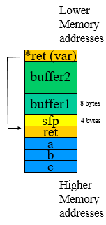
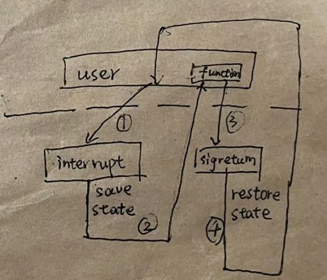
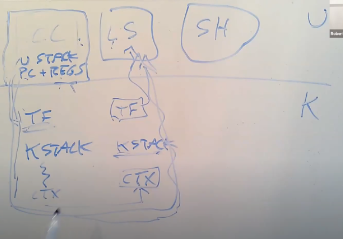

# MIT6.S081 操作系統總結
課程鏈接：https://pdos.csail.mit.edu/6.828/2021
參考文獻：https://mit-public-courses-cn-translatio.gitbook.io/mit6-s081/
學習操作系統兩個月之餘，終於斷斷續續地把近十個實驗學習完成。自己也對計算機的這個運作原理有了`入門` 級別的認識。現在我將對所有的實驗進行一次總結，以歸納所有的操作系統設計要點。

實驗記錄鏈接：

- [Utility](https://github.com/709519923/XV6/tree/util)
- [709519923/XV6 at syscall (github.com)](https://github.com/709519923/XV6/tree/syscall)
- [709519923/XV6 at page table (github.com](https://github.com/709519923/XV6/tree/pgtbl)
- [709519923/XV6 at traps (github.com)](https://github.com/709519923/XV6/tree/traps)
- [709519923/XV6 at cow (github.com)](https://github.com/709519923/XV6/tree/cow)
- [709519923/XV6 at thread (github.com)](https://github.com/709519923/XV6/tree/thread)
- [709519923/XV6 at lock (github.com)](https://github.com/709519923/XV6/tree/lock)

- [709519923/XV6 at net (github.com)](https://github.com/709519923/XV6/tree/net)
- [709519923/XV6 at fs(github.com)](https://github.com/709519923/XV6/tree/fs)

## 1. Utility

實驗記錄鏈接：第一個lab不熟練還不懂記錄，這裏放一個別人寫的參考代碼吧：

[XV6学习（1） Lab util - 星見遥 - 博客园 (cnblogs.com)](https://www.cnblogs.com/weijunji/p/XV6-study-01.html)

Utility這個名詞意思即一些需要頻繁使用的設施，一開始不太理解是什麽意思，直到在上cloud computing的時候，看了一個對cloud computing的解釋才知道，這個utility就像家裏面的自來水一樣，取之即用，經常使用，每天都要用的東西。那麽，在這個實驗當中，像`find` `xarg`這兩個都是linux系統當中經常會使用到的函數。還有`pipe()`，對應的就是在Linux當中的 | , 一開始還是挺不理解的。

此外，這個lab也涉及file descriptor這個東西，中文翻譯文件描述符，還不如別翻譯了，因爲描述符這個詞本來就很少見，我覺得這個fd應該叫做**文件映射對象**。之所以這麽描述，是因爲在`write` `read` `pipe`當中都會使用到這個fd去重定向。標準的輸出對象是屏幕，輸入對象是鍵盤。當我們需要將程序的輸入輸出保存在某個地方的時候，我們就可以重定向這兩個fd，就這麽簡單。

##  2. page table

實驗記錄：

[XV6/README.md at pgtbl · 709519923/XV6 (github.com)](https://github.com/709519923/XV6/blob/pgtbl/README.md)

頁表是virtualization的典型代表。

爲什麽需要這個東西？

我們平時寫的一個`main()`函數，編譯后得到的一段匯編文件，這段文件可以在系統中從頭到位地運行，我們稱之為一個**process**. 

操作系統當中有這麽多的process，就像我們平時在windows的任務管理器裏面看到的，爲了便於管理，我們就給每一個process分配一點RAM空間，系統工作的時候，每當執行某一個process裏面的代碼，我們就找到對應的RAM空間地址進行操作就好了。

但是這裏引出另一個問題：**共用内存**。 如果兩個process同時去訪問某一個變量，那他們在内存當中就需要先複製出來（因爲一段RAM只對應一個process），然後再操作。麻煩，能不能把這個變量**x**的内存同時被兩個process使用呢？這個時候我們就可以引出**page table**了， page table是一段虛擬地址對RAM裏面實際地址的映射，通過這樣的重定向，我們可以將**x**所在的地址都映射到RAM的同一個位置，從而實現共享内存這個trick， 當然還有別的tricks。如下：

> They allow xv6 to isolate different process’s address spaces and to multiplex them onto a single physical memory. Page tables are a popular design because they provide a level of indirection that allow operating systems to perform many tricks. xv6 performs a few tricks: mapping the same memory (a trampoline page) in several address spaces, and guarding kernel and user stacks with an unmapped page.  --xv6 book


**- Kernel:** 這是一個在操作系統當中的新概念，可以理解為它是一個管理員，能夠有權限調動計算機的所有資源。而一個process運行過程當中是沒法直接去調用到計算機的資源的，比如說訪問硬盤，訪問串口，訪問打印機。這個時候，就需要process通過特定的`syscall`叫kernel來訪問資源并且返回給process。

kernel也有一個page table，但是這個page table和RAM是直接映射的，因爲不同的資源已經分到了具體的RAM地址裏面，kernel(大部分，特例看P35)只需要一一對應就行，因爲它不需要像process一樣做tricks.

## 3. syscall & trap

在這兩個實驗當中，我們來談談process如何跟kernel溝通。

在syscall的實驗當中，首先就要自己動手加入一個`system call`，我跟著指示操作，完成后發現雖然寫了`trace()`這個函數在process裏面，但是卻並沒有實現這個函數，而是實現了一個叫做`sys_trace()`的系統函數，也就是說，`trace()`這個函數其實根據操作系統的規定，是有某一個機制能夠使其觸發我們的sys_trace()的. 下面這段匯編指令就是一個例子，把SYS_fork放到a7寄存器，然後使用`ecall`指令觸發即可。這個時候，CPU就是不執行process的常規指令了，就是陷入(`trap`)到kernel裏面，然後執行kernel裏面的system call. `syscall()`直接將a7的内容通過process的結構體獲得。(詳細可看trace的那個實驗)

```asm
.global fork
fork:
 li a7, SYS_fork
 ecall
 ret

```

```c
void
syscall(void)
{
  int num;
  struct proc *p = myproc();

  num = p->trapframe->a7;
  ...
}
```

此外，如果想要process（以下改成user，爲了與kernel形成對比）和kernel的`syscall`之間傳遞參數，則會使用到CPU的寄存器進行。比如在`sysinfo()`實驗當中，就有kernel拿下參數,和修改參數的兩個操作。

```c
  argaddr(0, &info_pointer); //get user's first argument
  if(copyout(p->pagetable, info_pointer, (char *)&info, sizeof(info)) < 0) //change the argument value
      return -1;
```


**- kernel/user stack:**  棧被存儲在page table的某一個page裏面，其記錄了匯編代碼運行的過程中，需要的一些**變量的值（local variable）**以及**函數完成之後需要返回的地址**(return address), PC會通過一個stack pointer寄存器的，逐個地獲取stack裏面的内容，結構如下：



儅執行到return時，stack pointer會跳到上一個函數所對應的地址，這些内容也跟著銷毀，周而復始直至所有的内容的出棧。


**中斷(interrupt)**  --實驗alarm

聊到中斷，我們不得不對trap機制進行補充。

前面，我們只是接觸到了兩個函數`sys_call()`和`sys_fork()`,也知道`ecall`指令可以觸發這兩個函數，但是trap到内核時，首先觸發的并不是這兩個函數，而是`usertrap()`, 它會判斷原因是什麽，例如：system call, 中斷，page fault. 

在alarm實驗當中，首先調用`sys_sigalarm`來設置報警函數地址，那麽這個地址保存到哪裏呢？返回user space之後這些地址就沒了啊？這個時候我們就要在`process` 結構體當中增加兩個變量來暫時保存它們。然後，中斷發生，再次觸發`usertrap`，每一次的觸發，就update一次`process`當中相關的tick變量，並到達次數之後做出相應的動作，也就是將**報警函數**地址傳到某一個寄存器裏面，等待返回時跳轉到該地址。 

關於中斷過程當中需要保存的變量：一個`trapframe`,中斷次數夠了，會調轉回到user，再觸發另一個system call-- `sigreturn()`，由於已經出來了一次，再進去恢復kernel原來的狀態就要提前設置保存的結構體。

```c
//usertrap()
memmove(p->alarm_saved_tf, p->trapframe, sizeof(p->alarm_saved_tf));
//sigreturn()
memmove(p->trapframe, p->alarm_saved_tf, sizeof(p->alarm_saved_tf));
```

過程如下圖：




## Copy-on-Write Fork(子進程寫前複製)

`fork()`這個函數會重新生成一個代碼一樣的子進程，并且運行之。而每個進程都會有一個page table，這就涉及到了page table的複製。當執行`exec()`的時候，系統就會執行新的代碼，而原有的page table就會被抛棄掉。這麽說，這樣的拷貝如果一次都沒有被使用的話，就會造成浪費。所以，對於子進程的這個page table，可以在映射物理地址的時候，映射到同一位置，從而不用拷貝多一份數據，等到執行程序時，確實要對某一個數據進行`write`操作的時候，再去copy一份出來也不遲。這裏的檢測機制是使用該page的某一個位，如果識別到是`cow`類型的page，則抛出`page fault`, 在内核當中再copy

這裏的idea是不難的，不過也牽扯到了另一個問題--數據共享

數據共享在多綫程的情況之下會產生race condition

所以，需要對page table裏面要操作的物理地址加入鎖，每一次要copy或者回收的時候就上鎖，然後更新這個page的引用次數，知道沒有`process`引用了，則允許釋放。

## Multithreading

**綫程透明**：

提到綫程，往往會跟process進行比較。在中文上就差一個子，但在英文就完全不是了。對於綫程的理解，其實最簡單的方法就是先假設你不懂這個概念。在這裏引出一個問題：假如我有一個CPU，但是我要同時去運行兩個`process`， 怎麽辦？首先想到的方法就是，一個`process`我去執行一段時間，只要CPU跑得足夠快，那麽對於`process`本身是感受不到它被停止運行的（這就是**透明綫程**的概念），我們將這個機制稱爲`**調度器(scheduler)**。

**實際上，`user`和`kernel`屬於不同的thread**

黨調用system call的時候，系統會執行`kernel`的函數，這個過程是一個thread的轉換，所以thread使用`trapframe`結構體來保存當前寄存器的工作狀態，用於後面恢復。而如果需要`process`進行切換，保存的結構體則叫做`context`

進程之間的切換如下圖，走了一大轉~~可謂十分困難



- 以下很好地解釋了進程和綫程的概念

> > 每一個CPU核在一個時間只會做一件事情，每個CPU核在一個時間只會運行一個線程，它要麼是運行用戶進程的線程，要麼是運行內核線程，要麼是運行這個CPU核對應的調度器線程
>
> 
>
> >學生提問：我們這里一直在說線程，但是從我看來XV6的實現中，一個進程就只有一個線程，有沒有可能一個進程有多個線程？
> >
> >Robert教授：我們這里的用詞的確有點讓人混淆。在XV6中，一個進程要麼在用戶空間執行指令，要麼是在內核空間執行指令，要麼它的狀態被保存在context和trapframe中，並且沒有執行任何指令。這里該怎麼稱呼它呢？你可以根據自己的喜好來稱呼它，對於我來說，每個進程有兩個線程，一個用戶空間線程，一個內核空間線程，並且存在限制使得一個進程要麼運行在用戶空間線程，要麼為了執行系統調用或者響應中斷而運行在內核空間線程 ，但是永遠也不會兩者同時運行。
> >
> >[11.4 XV6线程切换（二） - MIT6.S081 (gitbook.io)](https://mit-public-courses-cn-translatio.gitbook.io/mit6-s081/lec11-thread-switching-robert/11.4-xv6-thread-switching-2)

## Lock

现只是掌握了两种锁的类型，一种是`spinlock`，一种是`sleeplock`

`spinlock`实现：对某一个对象增设一个结构体，然后结构体一个变量`locked`, 获取的时候不断循环访问这个量即可。

`sleeplock`实现：使用`spinlock` 来保护这个`sleeplock`结构体， 调用睡眠锁之前，首先调用这个`spinlock`来保护不受第二个进程访问，然后调用`sleep(void *channel, lk)`,第一个参数设置一个通道用于唤醒，第二个参数--锁用于绑定相关的时间，表示睡觉的时候关注的是**锁**这个事件。喚醒的時候調用`wait()`函數即可。

兩個鎖的區別在於，`sleeplock`的使用可以yield CPU，不用浪費時間用於等待。

前面説到，`spinlock`的獲取會先關閉中斷，以防止死鎖情況的發生（比如中斷出現，另一個綫程需要這個lock）。如果是下面這種情況，AB兩個綫程需要交互，A要等待B的執行結束（比如B是串口，傳遞字符中），A綫程一直在用自旋鎖等待，那顯然不合理。這個時候，可以讓其休眠，出讓CPU，等B完成，再喚醒A，`sleeplock`就是用了類似于`channel`的概念來使CPU更加高效地運行。

## File system

文件系統關係到内存和硬盤之間的交互，最簡單的結構如下：

|      | bootblock | superblock | log  | inode | bitmap | data block |
| ---- | --------- | ---------- | ---- | ----- | ------ | ---------- |
| size | 1         | 1          | 30   | 13    | 1      | 954        |

boot和super記錄了一些meta數據，log用於crash recovery，`inode`是對`datablock`的索引，`bitmap`用於記錄沒有被使用的`datablock`

寫文件的簡化操作流程：

先寫log -- -|- -->  標記inode - - > 寫入data block - - > 更新inode

log的存在其實就保證了寫入數據的atomicity


# 後記

操作系統工程這門課的内容真的是太複雜了，包含了從0到1教你設計一個系統，讓整個電腦正常工作起來，做完了這麽多的labs，看了這麽多節課，尚且懂得了一些皮毛。但是也比僅僅是看文字概念要理解得通透。這也告訴了我一個道理，如果想要學習最基礎的計算機工程知識，光靠看文字是遠遠不夠的，就像水過鴨背一般，還是要結合源代碼，一點點去分析，有機會還要進入debug模式看運作細節，才真正懂得設計的精髓所在。最後感謝MIT的幾位教師和助教的資料，讓我學到了很多東西。

2023年3月10日 于雍雅花園8棟
